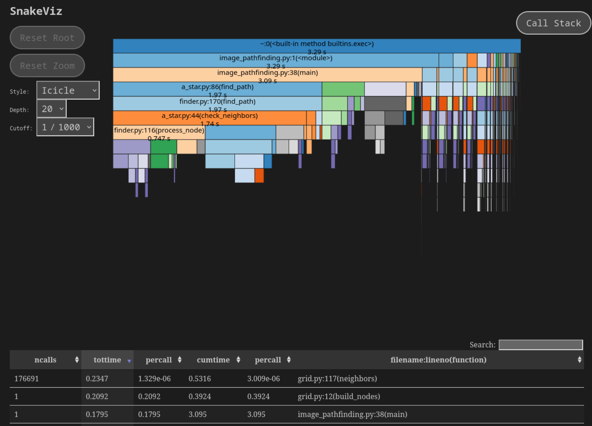

# Benchmarking
Many pathfinding algorithms need more system resources the bigger the input grid is, some are optimized for specific scenarios to (for example Jump-Point Search) for narrow passages, while others like Dijkstra are for a general solution that come at the cost of looking at all cells of the grid in the worst case.

## Creating and visualizing a benchmark

To record a run of python-pathfinding we can use the [cProfile](https://docs.python.org/3/library/profile.html)-module that comes with python3.

We can run it on the example with the loaded image to record a file named `benchmark.perf`:

```bash
cd examples/
python3 -m cProfile -o benchmark.perf image_pathfinding.py 
```

To visualize the recorded perf-file we install and run [snakeviz](http://jiffyclub.github.io/snakeviz/):

```bash
pip3 install snakeviz
snakeviz benchmark.perf
```
The snakeviz-ui allows you to check how long each part took and how often each function in the call stack has been executed.

It should look something like this:

which looks quite healthy, as it would be expected most of the time was spend on the A-Star finder, where processing the node inside the finder.py took 0.757 seconds and getting the neighbors 0.573 seconds. The rest inside pathfinding was spend on heap management. However these are also points where we could optimize most if we find a faster way to lookup nodes or use additional cache.

Note that process_node was called 349984 times, although the output in the terminal says `iterations: 176692 path length: 999`. This is because with 'iterations' we count how often we run the whole loop to processed a node including all its neighbors, while we have to run process_node for every neighbor.

## Memory
TODO